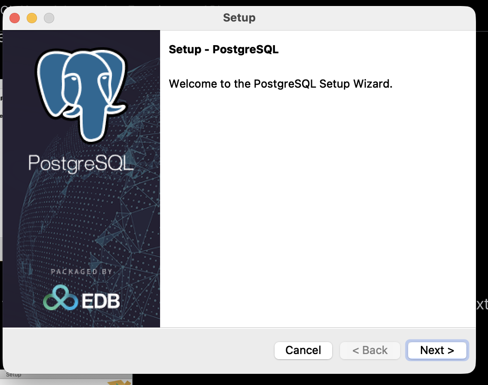
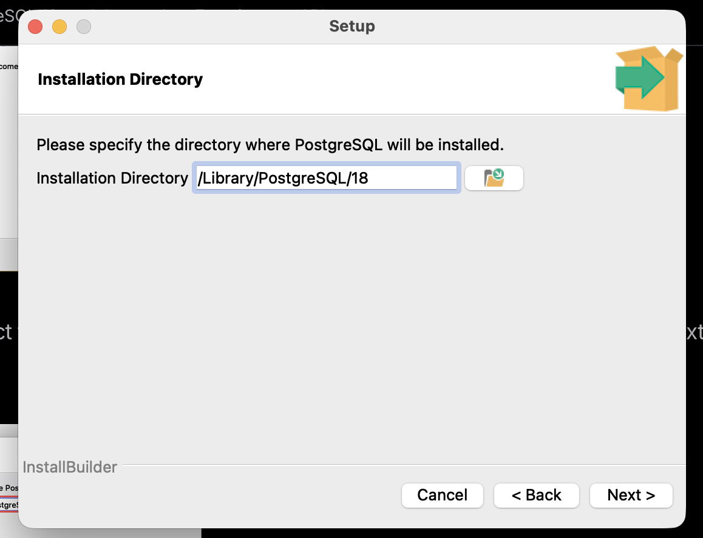
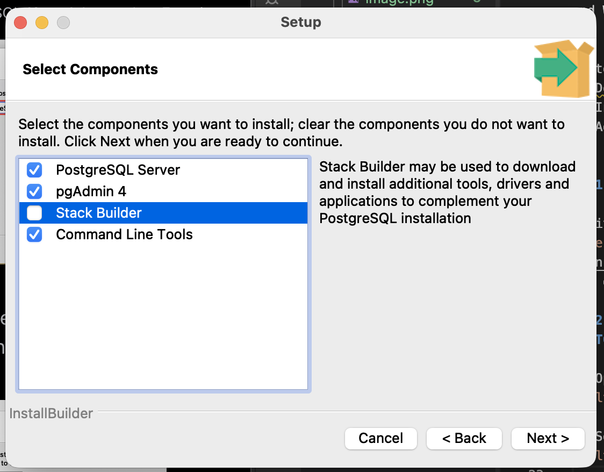
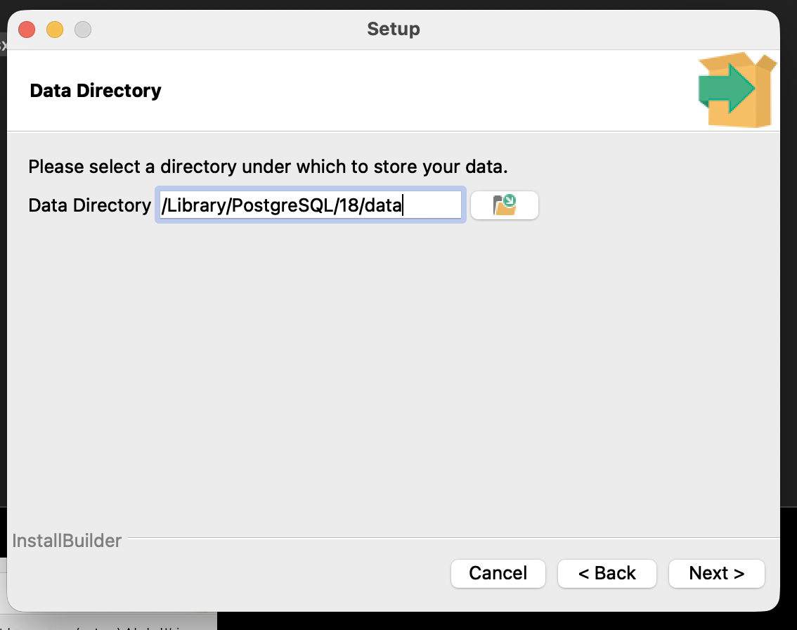
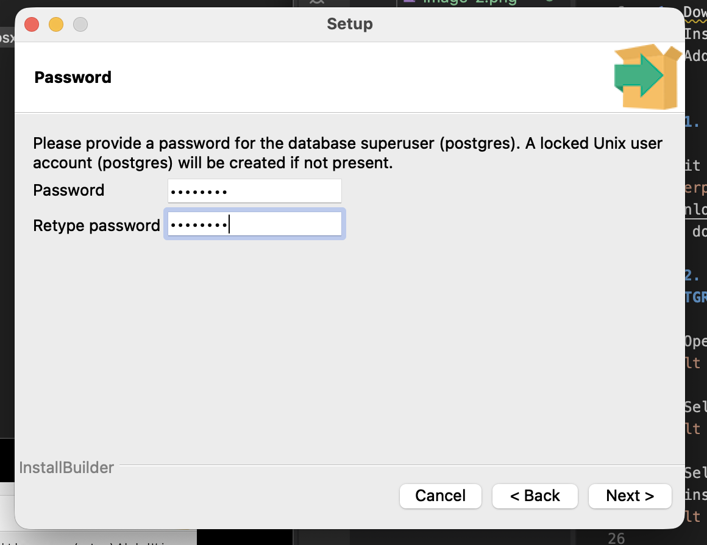
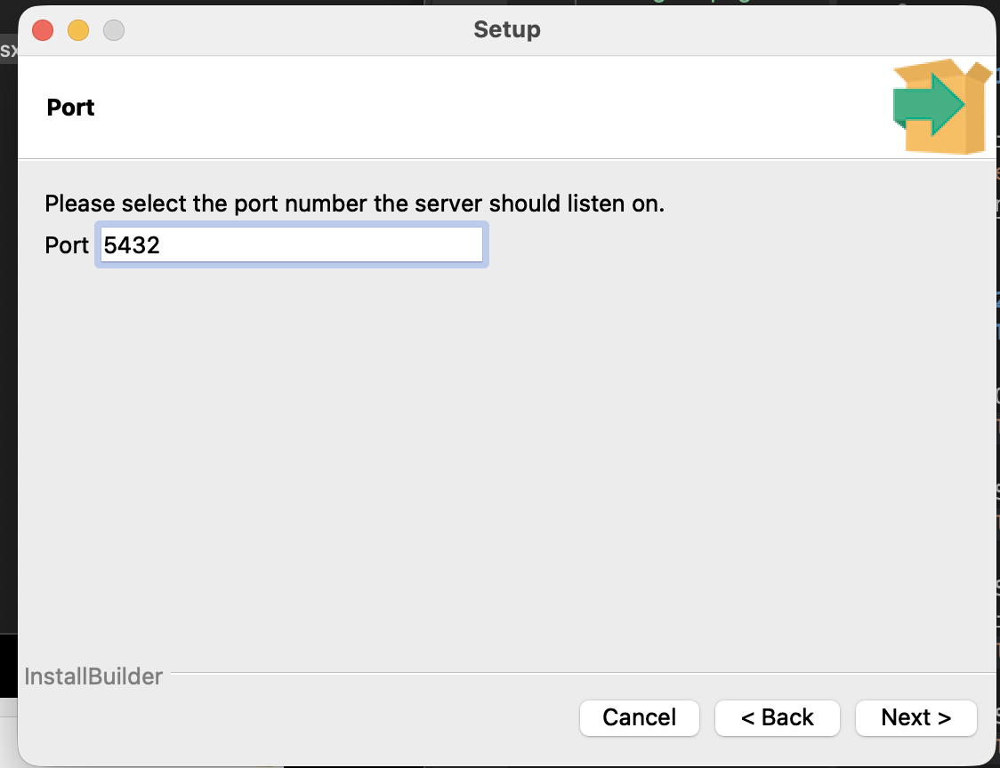
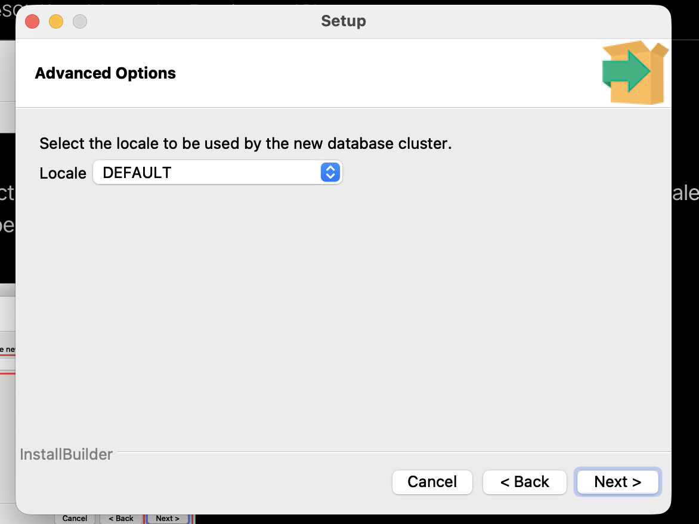
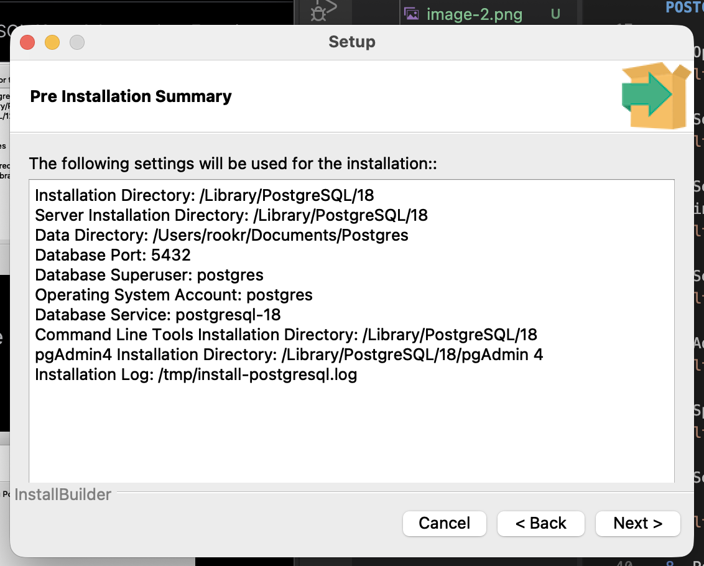

# Setuping Up Postgres

PostgreSQL was developed for UNIX-like platforms, however, it was designed to be portable. It means that PostgreSQL can also run on other platforms such as macOS, Solaris, and Windows.

The Following are some brief steps to install postgres:
1. Download the postgres installer .
2. Install the installer.
3. Add Path to the postgresSQL bin directory.

## 1. Download the postgres SQL installer

Visit the link [Postgres SQL Instllaer for EnterpriceDB](https://www.enterprisedb.com/downloads/postgres-postgresql-downloads)
and download for your operating system.

## 2. Follow the below steps to install POSTGRES

1. Open the installer

2. Select installation Directory

3. Select or Unselect services that you want to install 

4. Select the data directory 

5. Add root password 

6. Specify Port of operation

7. Select locale used by postgres

8. Post which postgress provides a installation summary.

9. Click next and  and start insallation

## S